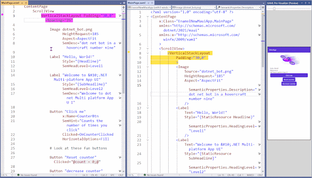

# ENAMEL - An RFC for possible future XAML-based development

## Executive Summary / TLDR

A new, simplified markup language to define application UI. The new files automatically generate comparable XAML files for your WPF, .NET MAUI, or WinUI app which is then compiled as normal. Fully configurable, totally optional (use it for some or all XAML files) and low risk as the XAML (and C#) files are still available.

It addresses the common complaints about having to work with XAML and adds new functionality without the need to change any of the existing tooling.

How much less verbose is it?

Well, this is the XAML for an Empty page in a .NET MAUI app.

```xml
<?xml version="1.0" encoding="utf-8" ?>
<ContentPage
    x:Class="NewMauiApp.MainPage"
    xmlns="http://schemas.microsoft.com/dotnet/2021/maui"
    xmlns:x="http://schemas.microsoft.com/winfx/2009/xaml">
</ContentPage>
```

And this is the exact same thing in ENAMEL.

```enamel
ContentPage
```

_There are more examples comparing XAML and ENAMEL [here](./comparisons/)_

ENAMEL: Simple, human readable, and easily maintainable UI markup.

## Introduction

For many developers, XAML (eXtensible Application Markup Language) is seen as verbose, hard to read, and difficult to work with. There are others who describe it a "fine" or "adequate".  
For both groups, that there has been no significant update to XAML since its launch, almost twenty years ago, highlights that it is overdue to consider what improvements or enhancements may be appropriate.

That XAML has existed for so long without the necessity for change can be considered a positive for the language as it shows reliability, stability, and the strengths of the original design.  
However, lots has changed in that time. Requirements, expectations, and what's possible, practical, & desirable have all evolved. Developers want, need and expect the tools and languages they use to improve over time. If they don't, when considered alongside alternatives, the tools can easily be perceived as getting worse.

XAML can be written in ways that follow conventions, patterns, and "best practices" of other programming languages to greatly improve the readability and maintainability of the code. (Such as [demonstrated in this workshop](https://github.com/dotnet-presentations/dotnet-maui-workshop/tree/main/Community%20Modules/XAML).) But this still more to read than is necessary for the person wanting to understand the intent and important details in the code.

This RFC was driven by a desire to ask "What could be done to improve the code used to declare a GUI interface if it wasn't limited by historic choices and restrictions of XML-based markup?" If the desire is to build "modern apps", using a twenty-year-old technology (a lifetime in tech terms) at least deserves to be questioned.

This is not an attempt to persuade anyone happy with the XAML they write or the alternative they use to switch from what they are currently being productive with. Use what works for you.  
However, for many people currently using XAML, there is an implicit understanding, or expectation, that things could be better. This RFC explores one possible solution.

## Why changing XAML is hard

Changing XAML is hard. Modifications risk breaking existing code and tooling.

A complete replacement would make some people think that they need to rewrite everything they currently have or be stuck on a legacy technology that would fail to get further updates. The plethora of options for building native Windows apps (many of which use XAML) already creates this feeling in many. Any solution should not look to extend this uncertainty. Similarly, .NET MAUI is growing steadily after the conversion from Xamarin.Forms. It would not be desirable to create confusion amongst users and those considering it after such a big, recent change.

An additional (official) option for defining UIs would also increase the total support overhead as XAML would still need to be supported for many years to come.

Variants of XAML are used by multiple frameworks and project types. These include (but are not limited to) WPF, .NET MAUI, and WinUI. Ideally, any change or alternative to XAML should not be limited to only one of these.

Creating a new, alternative language and integrating it with the tooling (IDEs, compilers, CI/CD systems) and the frameworks where it is used, has the potential to be a large amount of complex work. This risks prohibiting the number of possible alternatives that can be tried and the number of people with the skills to create such experiments. It's in no one's interest to take a lot of time (and/or spend a lot of money) on an experiment that may not turn into an actual product.

Trying new languages can be risky.  
Trivial demos rarely give a true impression of what a language is like to build "real" applications with. Completely rewriting an existing app can be time-consuming. Building something entirely new presents potential maintenance issues if the new app is wanted but the technology used to build it is not fully adopted.

Learning a new language can be hard and teaching/training can be expensive.

## A new language as a possible solution

ENAMEL (**E**xperimental **N**ative **A**pplication **M**arkup **E**xtension **L**anguage) is a new proposed language that avoids and addresses the challenges mentioned above.

It primarily addresses the above concerns by providing a way of creating valid XAML files that are then used by the existing tooling.  

1. Write ENAMEL (in a `.enml` file)
2. When the file is saved, it automatically generates a corresponding `.xaml` file.
3. The generated XAML files (and accompanying code-behind) are used as if written by hand.

The tooling to build the app ignores the new files it doesn't know about and Visual Studio's built-in capabilities to nest files means that the solution doesn't become cluttered.

It's fully optional.  
As the tools to build an app don't need the ENAMEL files it doesn't matter if they exist for some, none, or all the XAML files. This allows for incremental adoption as there's no need to rewrite all UI files at once in a new language. Additionally the risks of experimentation are also removed as if tried but not-ultimately adopted, the project still contains all the XAML it needs to keep on working.  
It's also optional in the sense that anyone happy with XAML as it currently is, is free to keep using it as they currently do. Additionally, any improvements to XAML or changes to the toolchain would benefit the people using XAML and any new solution that generates it.

It relies on a simple but powerful ruleset that is explained in detail below. By having such a small and specific set of rules it is easy to learn. These rules and syntax are also optimized for human readability, rather than the rigorous structure of something (XML) initially intended for reading and writing by machines.

In addition to producing XAML, ENAMEL also accepts XAML as valid input. Not only does this make migrating XAML to ENAMEL a trivial process, it also makes it easy to explore how it works with more complex examples in existing codebases.
An additional benefit of supporting "inline XAML" within an ENAMEL file is that it offers a fallback option for any particular elements that ENAMEL does not support or someone chooses not to convert.

It's not magic, it's just source generation. Source generation is increasingly used and accepted in .NET and other technology stacks. This proposed solution may be well timed to be accepted based on the widespread adoption of source generated C# code elsewhere in project that would use this.

By continuing to use the existing tool chains, ENAMEL has no direct dependency on or connection to any other technology. It could just as easily produce XAML files for use in WPF, WinUI, .NET MAUI, or anything else.

It is intended to be highly configurable. This enables the flexibility to support any dialect of XAML, and it also enables optimizations based on preferred ways of working and personal preferences.  
All configurable settings are also optional.

The simplicity of the language and the way of avoiding the need to modify existing toolchains means that experiments as to the suitability of this as a solution can be done quickly and cheaply. An initial proof-of-concept with basic Visual Studio integration was created in just two days.

A new language that produces XAML does not have the same constraints as XAML itself. This makes it simple to add features and functionality that are beneficial but impossible with XAML.

## Language goals

The design of the ENAMEL language has been guided by these principles:

- Be logically comparable with equivalent XAML.
- Avoid duplication and repetition.
- Aim for brevity AND clarity in the code.
- Prefer words over symbols and punctuation.
- Avoid adding keywords unless they offer clear and significant benefits.

The intention is to create something that anyone unfamiliar with the language would find easily understandable.

## Language rules

The language is defined by a small set of rules that are also very powerful.

### Basic rules

As the purpose is to create a XAML file that describes a "UI tree", an ENAMEL file also adopts a tree like structure that is representative of the `Elements` that may also have `Attributes` specified and zero or more children.

#### Elements and child-elements

The following rules define how to specify an Element in ENAMEL.

- Elements are specified by their name only. No brackets (angled or otherwise.)
- Each element starts on a different line.
- Child elements are indented from their parents.
- Siblings are always indented the same amount.
- Indenting can be any size (and use tabs, spaces, or both), but must be consistent among siblings.
- Blank lines (or containing only whitespace) _may_ be used to separate elements. These are not included in the generated output.

The following (partial) example uses elements (Types) from .NET MAUI but should be clear to all.

```ascii
Page
    VerticalStackLayout
        Label

        CollectionView
```

- Child elements may optionally be surrounded by curly braces (`{` &amp; `}`). If used, the opening brace should be on the end of the line containing the element opening. The closing brace should be on its own line and may be indented if desired.
- Curly braces can be nested as appropriate.

While neither are particularly useful, the following example is functionally equivalent to the one above.

```ascii
Page {
    VerticalStackLayout {
        Label

        CollectionView
    }
}
```

- XAML elements (anything inside matching angle brackets) are assumed to be valid XAML and are output directly as input.

Again, this example will produce the same output as above.

```ascii
Page 
    VerticalStackLayout 
        <Label />

        <CollectionView />
```

Few elements are defined without attributes to represent the properties that are set on the types created for an element.

#### Attributes  

The basic rules for specifying attributes are:

- Attributes are defined after an element name.
- Attributes can be defined on the same line as the element name or indented on immediately subsequent lines.
- Attribute values do not need to be enclosed in quotes if they do not contain spaces. (Quotes will be added as necessary in the generated XAML.)

The following three examples (using WinUI types) all produce the same output.

All attributes on one line and all in quotes.

```ascii
TextBlock Text="Hello ENAMEL!" FontSize="24" FontWeight="Bold"
```

Some attributes after the element name and the rest on the next line. The FontSize value does not use quotes.

```ascii
TextBlock Text="Hello ENAMEL!"
     FontSize=24 FontWeight="Bold"
```

All attributes on their own lines. The FontSize and FontWeight values do not use quotes.

```ascii
TextBlock
     Text="Hello ENAMEL!"
     FontSize=24
     FontWeight=Bold
```

### Other rules

- It is possible to specify multiple properties that should all have the same value by concatenating the property names with ampersands (`&`) before specifying the value. e.g. `Height&Width=100`

This ENAMEL:

```ascii
Rectangle Height&Width=100
```

Will produce this:

```xml
<Rectangle Height="100" Width="100" />
```

- Attributes specified as child elements can be implemented by prefixing the attribute name with a dot (`.`) to remove the need to specify the element name twice.

This means that the following are functionally the same:

```ascii
Button
    Button.Content
        TextBlock Text="Click me"
```

and

```ascii
Button
    .Content
        TextBlock Text="Click me"
```

- Whole lines can be treated as comments by making the first non-whitespace character a hash symbol (`#`).

This ENAMEL:

```ascii
# Try out comments in ENAMEL
```

Will become the following in the generated XAML:

```xml
<!-- # Try out comments in ENAMEL -->
```

- Individual attributes can be excluded from being included in the generated output by prefixing the name with a tilde (`~`).

So, this:

```ascii
TextBox ~Text="My WPF Example" Width="300" ~MaxLines=3 Margin="0,4,0,8"
```

will produce:

```xml
<TextBox Width="300" Margin="0,4,0,8" />
```

The ability to comment out individual attributes in XAML has been requested by many developers but is unsupported by XML. ENAMEL provides this missing feature and so makes it easier to try out the alteration (or removal) of specific attributes without having to remove them from the file. This removes the need to remember what has be changed or rely on the "undo" stack.

#### Advanced rules (based on settings)

Much of what is generated can be controlled by specifying settings.  
Settings are specified in a file named `enamel-settings.json` and can be placed anywhere in the solution (or files system). When an ENAMEL file is used to generate XAML, a settings file will be sought by looking in the same directory as the file. If a settings file is not found it will look for one in parent directories, all the way up to the root of the drive.

The above examples of the XAML generated have been oversimplified.  
All generated files automatically have an XML prolog added. There are also two settings that impact what is generated for the root element.

- An `x:Class` attribute can be automatically added if `AutoGenerateClass` is set to `true`. This adds a value based on the appropriate namespace and the class name that matches the file name.
- XML namespaces (and their aliases) can also be configured in settings by specifying the `DefaultRootNamespaces` property. These values are then used in attributes added to the root element of any generated file.

If the following settings file was used:

```json
{    
    "AutoGenerateClass": true,
    "DefaultRootNamespaces": [
        {
            "Alias": "",
            "Namespace": "http://schemas.microsoft.com/dotnet/2021/maui"
        },
        {
            "Alias": "x",
            "Namespace": "http://schemas.microsoft.com/winfx/2009/xaml"
        }
    ],
}
```

An empty .NET MAUI ContentPage could be as simple as (`MainPage.enml`):

```ascii
ContentPage
```

And still produce the following XAML:

```xml
<?xml version="1.0" encoding="utf-8" ?>
<ContentPage
    x:Name="MyDemoApp.Views.MainPage"
    xmlns="http://schemas.microsoft.com/dotnet/2021/maui"
    xmlns:x="http://schemas.microsoft.com/winfx/2009/xaml"
     />    
```

Not only does this remove a lot of the "noise" from the root element in an ENAMEL document, it also makes it much easier to know that all XML namespaces are available in every file and also that they all use the same alias for the same namespace.

- How the generated XAML is formatted can be controlled. While many formatting configuration options can be imagined, the initial version of ENAMEL is proposed to support `SingleLine` and `MultiLine` as options. These options will respectively put all the attributes on the same line as the opening element tag, or put each attribute on it's own line in the generated XAML file.

There are also settings to simplify the specifying of attributes.

- Some elements are _almost_ never used without specifying a specific attribute. (e.g. A `Label` or `TextBlock` is almost never used without setting the `Text` attribute.) Rather than repeatedly specify the name of this attribute in the ENAMEL, it can be specified in the setting as a **"default attribute"** and then used without specifying the attribute name when that element is used.  
To specify a value for the default attribute, it must be the first attribute specified immediately after the element name and on the same line.

So, with this setting:

```json
{
    "DefaultAttributes": [
        {
            "ElementName": "Label",
            "AttributeName": "Text"
        }
    ],
}
```

this:

```ascii
Label "Hello"
```

is  equivalent to:

```ascii
Label Text="Hello"
```

And, as the attribute value doesn't include a space, it's also acceptable to write:

```ascii
Label Hello
```

And all three of the above examples each generate this XAML:

```xml
<Label Text="Hello" />
```

Just as some attribute names are specified over and over in a file (and files), it can be common to see the names of some MarkupExtensions repeated multiple times.

- Specifying a `DefaultMarkupExtension` in the settings file allows this value to be inferred when a MarkupExpression appears to not have a specified MarkupExtension.

As an example, given this setting:

```json
{
    "DefaultMarkupExtension": "Binding",
}
```

The following two `Labels` produce the same XAML:

```ascii
Label Text="{Binding Name}"

Label Text="{Name}"
```

In fact, if combined with the default attribute specified previously and the fact that the attribute value has no space, the ENAMEL can become even simpler:

```ascii
Label {Name}
```

It doesn't take much to get used to being able to read that as "A Label with the Text bound to the Name property (of the BindingContext/DataContext)."

And as you'd expect it still produces the XAML as below.

```xml
<Label Text="{Binding Name}" />
```

There aren't only settings for removing the need to specify some things. There are also settings that change what's entered in an ENAMEL file.

- "Expansions" allow a single element to be replaced with multiple nested elements in the generated XAML. This enables the removal of some nesting and the simplifying of the ENAMEL code.

An `Expansion` can be specified that will look for an element with a specified name and expand it to multiple elements based on a comma-separated list of element names.

For example, with a settings file like this:

```json
{
    "Expansions": [
        {
            "LookFor": "ItemTemplate",
            "ExpandTo": "ItemTemplate,DataTemplate"
        }
    ],
}
```

ENAMEL like this:

```ascii
ListView
    .ItemTemplate
        Grid
```

can generate this XAML:

```xml
<ListView>
    <ListView.ItemTemplate>
        <DataTemplate>
            <Grid />
        </DataTemplate>
    </ListView.ItemTemplate>
</ListView>
```

- Element and attribute names also support defined substitutions. Any such defined values are replaced in the generated XAML.

These settings:

```json
{
    "Substitutions": [
        {
            "LookFor": "HSL",
            "ReplaceWith": "HorizontalStackLayout"
        },
        {
            "LookFor": "VSL",
            "ReplaceWith": "VerticalStackLayout"
        },
        {
            "LookFor": "RowDefs",
            "ReplaceWith": "RowDefinitions"
        },
        {
            "LookFor": "ColDefs",
            "ReplaceWith": "ColumnDefinitions"
        }
    ]
}
```

allow this ENAMEL:

```ascii
VSL
```

to produce:

```xml
<VerticalStackLayout />
```

or

```ascii
Grid RowDefs=*,* ColDefs=50,Auto
```

to generate

```xml
<Grid RowDefinitions="*.*" ColumnDefinitions="50,Auto" />
```

Speaking of Grids. Grids can be powerful controls and are often the only practical way of defining some UI layouts. However, the use of Grids can lead to complex code that requires alterations in multiple places when even a small change is needed.

#### Rules relating to new keywords

Improved ways of working with complex grids may come in time, but Grids are sometimes needed for simpler scenarios that still require more code than anyone should have to type.

Introducing `AUTOGRID`

`AUTOGRID` (**in all caps-like all ENAMEL keywords**) is like a regular Grid but it will automatically assign Row and Column values to it's direct child elements based on the defined row and column definitions.

So, this:

```ascii
AUTOGRID RowDefs="*,*" ColDefs="*,*"
    Label "Top Left"
    Label "Top Right"
    Label "Bottom Left"
    Label "Bottom Right"
```

will generate

```xml
<Grid RowDefinitions="*,*" ColumnDefinitions="*,*">
    <Label "Top Left" Grid.Row="0" Grid.Column="0" />
    <Label "Top Right" Grid.Row="0" Grid.Column="1" />
    <Label "Bottom Left" Grid.Row="1" Grid.Column="0" />
    <Label "Bottom Right" Grid.Row="1" Grid.Column="1" />
</Grid>
```

In the above, Row and Column values are assigned as both have definitions. If only one is defined (as below), that's all that is output.

```ascii
AUTOGRID RowDefs="Auto,*,Auto"
    Label "Header"
    Label "body"
    Label "Footer"
```

Generates

```xml
<Grid RowDefinitions="Auto,*,Auto" />
    <Label "Header" Grid.Row="0" />
    <Label "body" Grid.Row="1" />
    <Label "Footer" Grid.Row="2" />
</Grid>
```

- ENAMEL supports two looping constructs: `FOR` and `FOREACH`.

A `FOR` loop works with numeric values.

The syntax is `FOR {identifier}={lowestNumber}..{highestNumber}`.  
You can then reference the identifier in child elements with the syntax `${identifier}`.

For each integer value in the specified range, children of the `FOR` element will be generated and with reference to the identifier being included where and if wanted.

For example:

```ascii
FOR i=0..4
    Entry Placeholder="$i" x:Name="Entry$i"
```

Will generate:

```xml
    <Entry Placeholder="0" x:Name="Entry0" />
    <Entry Placeholder="1" x:Name="Entry1" />
    <Entry Placeholder="2" x:Name="Entry2" />
    <Entry Placeholder="3" x:Name="Entry3" />
    <Entry Placeholder="4" x:Name="Entry4" />
```

A `FOREACH` loop is similar to a `FOR` but iterates over an arbitrary list of strings.

The syntax is `FOREACH {identifier}={comma separated list of values, optionally quote enclosed}`.  
You can then reference the identifier in child element, with the syntax `${identifier}`.

So, this ENAMEL

```ascii
FOREACH numb=one,two,"three hundred"

    Label $numb
```

generates this XAML

```xml
    <Label Text="one" />
    <Label Text="two" />
    <Label Text="three hundred" />
```

#### Generating multiple files

An attempt to consider the future evolution of XAML would be incomplete without exploring the possibility of also incorporating C# code within the file.

Rather than attempting to recreate something like Razor pages (which would require changes to the platforms using the XAML files), the approach here is to try and incorporate simple C# snippets into the file where the GUI is defined, rather than having to enter them into the "code behind" file.

C# code can be specified in the value of an attribute representing an Event. To make it clear that this is "inline C#" code, the attribute value is prefixed and suffixed with at signs (`@`). This is to make it clear that the attribute value is different from other attributes and a variation on the use of curly braces to indicate Markup Expressions.

The trailing `;` is not required within the ENAMEL file and will be added if not included.

When the XAML is generated, the attribute value is replaced with a generated event name and an additional C# file is created containing a partial class with events that contain the C# from the .enml file.

An example makes it clearer.

Initial file: `InlineExamplePage.enml` (partial)

```ascii
Button "operate on variables inside the code behind file"
    Clicked="@ count=0 @"

Button "Invoke the command!"
    Clicked="@ vm.MyCommand.Invoke() @"

Button "do something"
       x:Name="MyButton"
       Clicked="@ DoSomething() @"
```

Generated file: `InlineExamplePage.xaml` (partial)

```xml
<Button 
    Text="operate on variables inside the code behind file"
    Clicked="Gen_On_Button1_Clicked" />

<Button
     Text="Invoke the command!"
     Clicked="Gen_On_Button2_Clicked" />

<Button
    Text="do something"
    x:Name="MyButton"
    Clicked="Gen_On_MyButton_Clicked" />
```

Additional generated file: `InlineExamplePage.enml.cs` (full)

```csharp
namespace MyDemoApp.Views;

partial class InlineExamplePage
{
    private void Gen_On_Button1_Clicked(object sender, EventArgs e)
    {
        count=0; 
    }
    
    private void Gen_On_Button2_Clicked(object sender, EventArgs e)
    {
        vm.MyCommand.Invoke(); 
    }
    
    private void Gen_On_MyButton_Clicked(object sender, EventArgs e)
    {
        DoSomething(); 
    }    
}

```

While the writing of large amounts of C# inside an ENAMEL file is probably undesirable, as a quick way to interact with or invoke something in the code behind file it may be useful.  
With its ability to act as a way to execute Commands on the ViewModel from a control that doesn't support invoking commands directly, it may be simpler than other "EventToCommand" solutions.

## Why this name?

Not only is ENAMEL by far the best name so far considered, there are multiple factors that make it appropriate:

- It's a real word and so is recognizable.
- It's not a name used by any other technology-related project.
- It's easy to pronounce.
- It's a good acronym. (Experimental Native Application Markup Extension Language)
- It's not too long. (6 letters)
- The name overlaps a lot with XAML.
- It can include (but is not tied to) the word "experimental" which highlights the current nature of its existence.
- Enamel (of the porcelain variety) is tough, durable and pleasing to look at. All qualities desirable in this context too.
- Associations to tooth enamel may be unfortunate for some people, but comparisons to a hard outer layer that offers protection from decay cannot be overlooked.

## But does it work?

The ideas described above have been explored in a prototype that has been so transformational that I'm reluctant to stop using it. However, this is not yet being made public for two reasons.

1. To avoid focusing discussion on the prototype when it is the concept and possibilities of the language/solution that are more important.
2. Because it is a very minimal implementation with some bugs. I don't want to focus on fixing those bugs or supporting something that was created to prove a concept when the exact specification of the language or if it should ever be anything more than a concept are still under discussion.

Here's proof it exists though:



The above animation shows 3 windows inside Visual Studio.

- On the left is an .enml file in an editor window.
- In the middle is the .xaml file produced from the ENAMEL.
- On the right is a design-time "pre-visualization" of what the page will [approximately] look like.

_Yes, this is .NET MAUI's default new page with some additional buttons at the bottom._

In the animation:

1. The Spacing attribute (highlighted in pink) is uncommented in the ENAMEL and the file saved.
2. This causes the XAML to be updated (yellow highlight) and that attribute added.
3. This change is also reflected in the "pre-visualization" of the XAML.

_Note. The "Pre-Visualizer" is separate to anything discussed here._

## Call to action

ENAMEL is presented here as a possible way that development with XAML could be made simpler.  
It is not intended as _the_ solution, but as an encouragement to discuss what might be.

XAML has not seen significant improvement in far too long and other proposals offer only small, incremental change. **Let's be bold and consider a big change!**

Please create or add to issues with any thoughts, comments, concerns, suggestions, ideas, etc.

Alternatively, I can be contacted via [most social media sites](https://mrlacey.com/social).

_p.s._

There's more on the background to the creation of this proposal in both [short](https://www.mrlacey.com/2025/03/the-state-future-of-xaml-summary-of.html) and [long](https://www.mrlacey.com/2025/03/my-talk-at-maui-day-in-london.html) forms on my blog.
